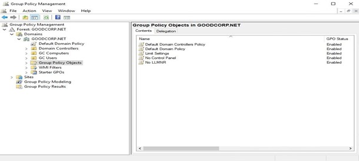
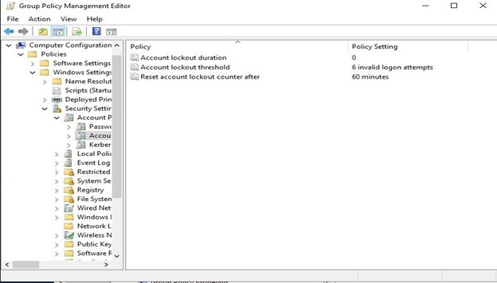
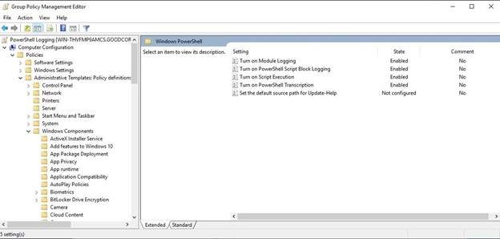
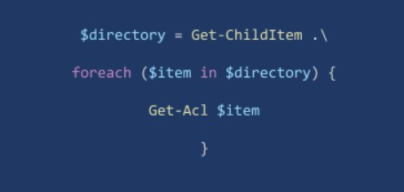
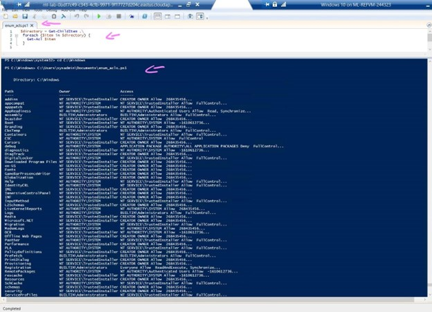

# A Day in the Life of a Windows Sysadmin

### **Create a GPO: Disable Local Link Multicast Name Resolution (LLMNR)**
1. Investigate and mitigate one of the attack vectors that exist within a Windows domain: `Local Link Multicast Name Resolution (LLMNR)`. 



LLMNR is a protocol used as a backup (not an alternative) for DNS in Windows.

When Windows cannot find a local address (e.g. the location of a file server), it uses LLMNR to send out a broadcast across the network asking if any device knows the address.

A LLMNR’s vulnerability is that it accepts any response as authentic, allowing attackers to poison or spoof LLMNR responses, forcing devices to authenticate to them.

An LLMNR-enabled Windows machine may automatically trust responses from anyone in the network.
<br>
<br>
<br>
### **Create a GPO: Account Lockout**

2. An account lockout disables access to an account for a set period, after a specific number of failed login attempts. This policy defends against brute-force attacks, in which attackers can enter a million passwords in just a few minutes.


<br>
<br>
<br>
### **Create a GPO: Enabling Verbose PowerShell Logging and Transcription**

PowerShell is often used as a living off-the-land hacker tool. This means that Once a hacker gains access to a Windows machine, they will leverage built-in tools, such as PowerShell and wmic, as much as possible to achieve their goals while trying to stay under the radar.

This type of policy is important for tools like SIEM and forensics operations, as it helps combat obfuscated PowerShell payloads.

3. Create a Group Policy Object to enable PowerShell logging and transcription. This GPO will combine multiple policies into one, although they are all under the same policy collection.
    * Enable the Turn on PowerShell Script Block Logging policy. This policy uses the following template to log what is executed in the script block:

```
    $collection = 

foreach ($item in $collection) {
    
         <Everything here will get logged by this policy>
}

```
<br>


<br>
<br>
<br>

### **Create a Script: Enumerate Access Control Lists**
4. In Windows, access to files and directories is managed by Access Control Lists (ACLs).  ACLs use security identifiers to manage which principals can access which resources.

`Get-Acl` without any parameters or arguments will return the security descriptors of the directory you're currently in.

`Get-Acl <filename>` will return the specific file's ACL.


<br>
<br>
<br>

### **Verify Your PowerShell Logging GPO**
5. test and verify that our PowerShell logging GPO is working properly.
<br>
<br>

